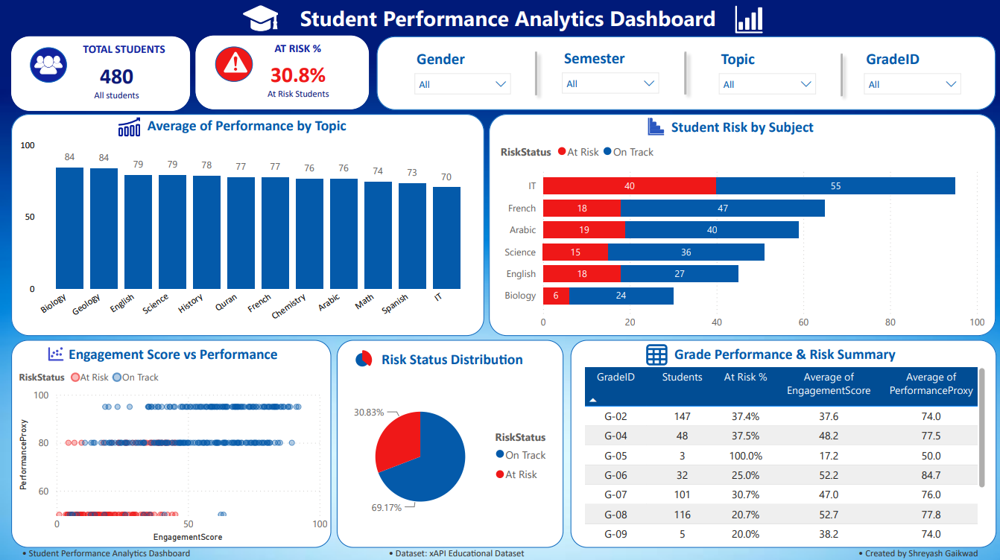

# 🎓 EduAnalytics: Student Performance Dashboard

An end-to-end Data Analytics project built using Python and Power BI to analyze student engagement, attendance, and academic performance.

The goal of this project was to practice the complete data analytics workflow—from data cleaning and feature engineering to building an interactive dashboard that presents meaningful insights.

---

## 📌 Project Objective

The xAPI Educational Dataset contains information about students' classroom participation, attendance, and academic performance.

The objective of this project was to:

- Clean and prepare the dataset for analysis
- Create meaningful features for easier interpretation
- Explore relationships between engagement, attendance, and performance
- Build an interactive Power BI dashboard to present the findings

---

## 🛠 Tech Stack

- Python
- Pandas
- Matplotlib
- Jupyter Notebook
- Power BI
- DAX

---

## 📂 Project Workflow

1. Data Collection
2. Data Cleaning
3. Feature Engineering
4. Exploratory Data Analysis (EDA)
5. Export Processed Dataset
6. Power BI Dashboard Development
7. Insights & Recommendations

---

## ⚙️ Feature Engineering

The original dataset contained several engagement-related columns and categorical performance labels. To simplify analysis, the following features were created:

### 📊 Engagement Score

A single engagement metric created by averaging:

- Raised Hands
- Visited Resources
- Announcements View
- Discussion Participation

This combines four engagement indicators into one score (0–100), making it easier to compare students.

---

### 🚩 Attendance Risk

Students with more than seven absence days were flagged as:

- **1 → At Risk**
- **0 → Not At Risk**

This simplifies attendance analysis within the dashboard.

---

### 🎯 Performance Proxy

The original performance classes (L, M, H) were converted into numerical values.

| Class | Score |
|------|------:|
| L | 50 |
| M | 80 |
| H | 95 |

This allows average performance to be calculated and compared across different groups.

---

### ⚠️ Risk Status

Students were classified as **At Risk** if they met all of the following conditions:

- High attendance risk (more than 7 absence days)
- Below-median engagement
- Low or Medium academic performance

Otherwise, they were classified as **On Track**.

---

## 📊 Dashboard Pages

### 📈 Page 1 – Executive Dashboard

Provides a high-level overview of:

- Total Students
- At Risk Percentage
- Average Performance by Subject
- Student Risk by Subject
- Engagement vs Performance
- Risk Status Distribution
- Grade Performance & Risk Summary
- Interactive Filters

---

### 📚 Page 2 – Performance Analysis

Focuses on:

- Average Engagement by Gender
- Average Performance by Semester
- Average Performance by GradeID
- Performance Matrix by Subject and Grade  
- Average Engagement by Subject

---

### 🚨 Page 3 – Student Risk Analysis

Provides a deeper analysis of:

- At Risk Students by Gender
- At Risk Students by Grade
- Attendance Risk Distribution
- Student Absence by Subject
- Detailed At Risk Student Table

---

## 📈 Key Insights

- Approximately **31%** of students were identified as **At Risk**.
- Students with higher engagement generally achieved better academic performance.
- Student engagement varied across different academic subjects.
- Attendance was an important factor in identifying students who may require additional support.

---

## 💡 Recommendations

Based on the dashboard findings:

- Monitor students with low engagement and high absence at an early stage.
- Increase classroom participation in subjects with lower engagement scores.
- Provide targeted academic support for students identified as "At Risk."
- Track engagement metrics regularly to identify performance trends before academic outcomes decline.
- Use dashboard insights to support data-driven interventions by educators.

---

## 📷 Dashboard Preview

<h3>📈 Executive Dashboard</h3>

Additional report pages include:

- 📚 Performance Analysis
- 🚨 Student Risk Analysis

See the Power BI (.pbix) file for the complete interactive report.
## 📚 Dataset

**Dataset:** xAPI Educational Dataset

**Source:** https://www.kaggle.com/datasets/aljarah/xAPI-Edu-Data

---

## 👨‍💻 Author

**Shreyash S. Gaikwad**

LinkedIn: https://www.linkedin.com/in/shreyash-gaikwad-66154a286
